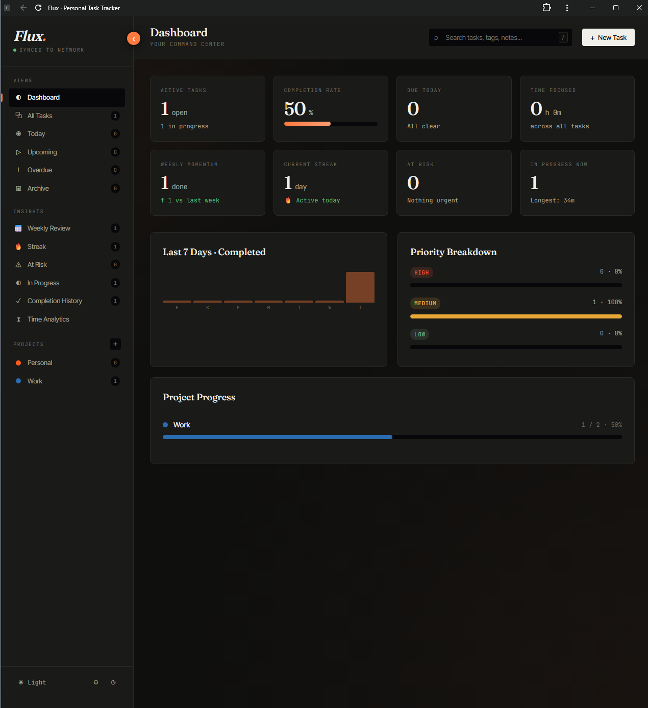

# Flux — Personal Task Tracker

A self-hosted task and productivity tracker built for personal productivity, work projects, and everything in between. Runs locally on your PC, stores data in a folder of your choosing, auto-starts on login, and costs nothing to operate.

**Completely yours** — no cloud accounts, no subscriptions, no telemetry, no tracking. The code is one HTML file and one PowerShell script you can inspect, modify, and own forever.

---

## What You'll Need

- **Windows 10 or 11** (uses built-in PowerShell and Task Scheduler)
- **A modern browser** — Chrome or Edge recommended for PWA install

No admin rights required for most setups. No extra software to install.

---

## Files in This Package

Place all of these together in one folder (e.g., `C:\My Apps\Flux\`):

- `Flux-Tracker.html` — the app itself (UI + all logic)
- `Start-Flux.ps1` — PowerShell backend that hosts the app and reads/writes data
- `Flux.vbs` — silent launcher for the backend (double-click to start Flux manually)
- `Flux-AutoLaunch.vbs` — startup-folder launcher that waits for the backend and opens the PWA
- `README.md` — this file

---

## Quick Start (5 minutes)

1. **Put the files somewhere permanent** — e.g., `C:\My Apps\Flux\`. Avoid Downloads or temp folders.
2. **Double-click `Flux.vbs`** — it'll auto-create your data folder (default: `Documents\Flux_Data`), seed it with starter projects, register the auto-start task, and open your browser to `http://localhost:7789`.
3. **Install as a PWA** — in Chrome/Edge, three-dot menu → Install as app → name it "Flux".
4. **(Optional) Set up login auto-launch** — see Step 5 below.

That's the whole setup. The default config works out of the box. Skip to the [Features](#features) section to start using Flux, or keep reading for the detailed setup and customization options.

---

## Full Setup

### 1. Choose where to put the app files

Pick a permanent location for the Flux files. Good choices:

- `C:\My Apps\Flux\`
- `C:\Users\YourName\Documents\Flux\`
- `D:\Tools\Flux\`

Avoid `Downloads` or temp folders — make it somewhere you won't accidentally delete.

### 2. (Optional) Customize your data folder

By default, Flux will store your data in `C:\Users\YourName\Documents\Flux_Data`. If that's fine with you, **skip this step** — you don't need to edit anything.

If you want to store your data somewhere else (network share, OneDrive, external drive, etc.), open `Start-Flux.ps1` in Notepad and find:

```powershell
DataFolder = "$env:USERPROFILE\Documents\Flux_Data"
```

Change it to any folder path. Examples:

**Network share (syncs between work PCs):**
```powershell
DataFolder = "\\your-server\your-user$\Documents\Flux_Data"
```

**OneDrive (access from multiple devices):**
```powershell
DataFolder = "$env:USERPROFILE\OneDrive\Flux_Data"
```

**Custom local folder:**
```powershell
DataFolder = "D:\Productivity\Flux_Data"
```

> **Note:** `$env:USERPROFILE` expands to `C:\Users\YourName` automatically — use it if you want the path to work across different usernames.

Save the file. Flux will auto-create the folder on first launch if it doesn't exist.

### 3. Start the backend for the first time

Double-click **`Flux.vbs`**. On this first run it will:

- Create your data folder if it doesn't exist
- Create `flux-data.json` with starter projects (Personal, Work)
- Create a `backups\` subfolder for automatic snapshots
- Create a `flux.log` file for troubleshooting
- Register a Windows Scheduled Task (`FluxTaskTracker-AutoStart`) so the backend starts silently on every login
- Open your default browser to `http://localhost:7789`

If nothing happens when you double-click, see the Troubleshooting section — 99% of the time it's a PowerShell execution policy issue that takes 10 seconds to fix.

### 4. Install as a Progressive Web App (PWA) — recommended

Installing Flux as a PWA gives you a clean standalone window with no URL bar, a dedicated desktop icon, and a Start Menu entry — it looks and feels like a native Windows app.

**In Chrome:**
1. Navigate to `http://localhost:7789`
2. Three-dot menu → **Cast, save, and share** → **Install page as app...**
3. Name it **"Flux"** → **Install**

**In Edge:**
1. Navigate to `http://localhost:7789`
2. Three-dot menu → **Apps** → **Install this site as an app**
3. Name it **"Flux"** → **Install**

Once installed, you'll have a Flux icon on your desktop and in the Start menu.

### 5. (Optional) Make it open automatically on login

To have Flux open automatically when you log into Windows:

1. Make sure `Flux-AutoLaunch.vbs` is in the same folder as the other Flux files
2. Press `Win + R` → type `shell:startup` → Enter
3. Right-click in the Startup folder that opens → **New** → **Shortcut**
4. Browse to your `Flux-AutoLaunch.vbs` location → Next
5. Name it **"Flux Auto-Launch"** → Finish

Now every time you log in:
- The backend starts silently via the scheduled task
- A few seconds later, the auto-launcher opens the Flux PWA window
- You're ready to go

The auto-launcher supports both Chrome and Edge PWAs and will also fall back to opening the URL in your default browser if it can't find the PWA shortcut.

### 6. (Optional) Turn off browser auto-open on startup

If you installed the PWA and want ONLY the PWA window to open (not a browser tab as well), edit `Start-Flux.ps1` and change:

```powershell
AutoOpenBrowser = $true
```

to:

```powershell
AutoOpenBrowser = $false
```

Save, then restart the backend (Task Manager → kill `powershell.exe` → double-click `Flux.vbs`).

---

## How It All Works

### The three moving parts

| Component | What it does | When it runs |
|-----------|-------------|--------------|
| **PowerShell backend** | Hosts Flux on `localhost:7789` and handles JSON file I/O | Starts silently at login via Scheduled Task. Runs 24/7 in background. |
| **Auto-launcher (VBS)** | Waits for backend, then opens the PWA window | Runs on login via Startup folder |
| **PWA window** | The actual UI you interact with | Opens automatically on login; closing it doesn't stop the backend |

### Where your data lives

Wherever you pointed `DataFolder` in Step 2 (defaults to `C:\Users\YourName\Documents\Flux_Data`):

- **Live data**: `YourDataFolder\flux-data.json`
- **Auto-backups**: `YourDataFolder\backups\` — last 10 snapshots, rotated automatically on each save
- **Local safety net**: browser's localStorage is updated on every change as a fallback for folder access issues
- **Activity log**: `YourDataFolder\flux.log`

Everything auto-saves. The sync indicator in the top-left of the sidebar (next to "Flux") shows the current state:

- **Green** = synced to your data folder
- **Yellow (pulsing)** = saving in progress
- **Red** = folder unreachable, using localStorage only
- **Grey** = no backend connected, localStorage only

---

## Features

### Views

- **Dashboard** — analytics overview with 8 clickable stat cards (Active Tasks, Completion Rate, Due Today, Time Focused, Weekly Momentum, Current Streak, At Risk, In Progress Now)
- **All Tasks** — everything active
- **Today** — due today + overdue
- **Upcoming** — next 7 days
- **Overdue** — past-due tasks needing attention
- **Archive** — completed tasks organized by year and month, with List and Calendar view modes
- **Projects** — one view per project (click the `+` to create new ones)
- **Tags** — filter by any tag in use

### Insights (sidebar shortcuts to analytics pages)

- **Weekly Review** — this week vs last week, day-by-day bars, carrying-over list
- **Streak** — current and longest streaks, 90-day contribution heatmap
- **At Risk** — overdue + due in next 2 days, grouped by urgency. Badge turns red when there are items
- **In Progress** — active tasks sorted by longest running, flags "stale" tasks (3+ days)
- **Completion History** — every finished task with timing breakdown, fastest completion highlight
- **Time Analytics** — where your focus has gone, by project, priority, and top tasks leaderboard

### Layouts (available per view)

- **Kanban** — drag-and-drop between To Do / In Progress / Done. Done column sorted by most recently completed.
- **List** — table with sortable columns, quick checkbox completion
- **Calendar** — month grid, tasks appear on their due dates, click a day to add a task on that date

### Task management

- **Task detail page** — full-page view with progress bar, status timeline, time-in-status breakdown, quick status buttons, notes, subtasks, tags, and edit/delete actions
- **Priority levels** — High / Medium / Low with colored indicators
- **Due dates** with overdue alerts
- **Subtasks** with individual checkboxes
- **Notes** per task
- **Tags** — comma-separated, filterable from sidebar
- **Recurring tasks** — Daily / Weekdays / Weekly / Monthly. Next occurrence auto-generates on completion.
- **Status history tracking** — every status change is logged with timestamp, enabling the timeline and time-in-status analytics
- **Auto-archive** — tasks completed in prior months move to Archive on the 1st of the next month
- **Undo** — 5-second toast window after deletions

### Productivity tools

- **Quick-add bar** at the top of Kanban and List views. Parses:
  - `#project` — assign to project (first name match)
  - `!high` / `!med` / `!low` — priority
  - `^today` / `^tomorrow` / `^mon`–`^sun` / `^2026-05-01` — due date
  - `+tagname` — tags
  - Example: `Fix printer jam #work !high ^tomorrow +hardware`
- **Pomodoro timer** (click the circle icon bottom-left) — 25/5/15 minute presets, auto-logs completed sessions to whichever task is currently "In Progress"
- **Global search** — press `/` to focus, searches titles, notes, and tags
- **Browser notifications** — nudges for tasks due today and overdue items (permission prompt on first launch)
- **Collapsible sidebar** — click the orange toggle button on the sidebar edge (or press `B`) to collapse it to an icon rail for more main-content space

### Themes and accessibility

- **Light and dark themes** — toggle in sidebar footer or press `T`
- **Keyboard shortcuts** (all documented in Settings):
  - `N` — New task
  - `/` — Focus search
  - `K` / `L` / `C` — Kanban / List / Calendar layout
  - `D` — Dashboard
  - `T` — Toggle theme
  - `B` — Toggle sidebar
  - `Esc` — Close modal

### Data management

- **Settings modal** (gear icon) — enable notifications, Export JSON backup, Import JSON restore, view sync status, see all keyboard shortcuts and quick-add syntax

---

## Customization

Flux is designed to be personalized. All customization lives at the top of `Start-Flux.ps1`:

### Change the port

If `7789` conflicts with something else on your system:

```powershell
Port = 7789  # Change to any free port
```

Restart the backend after changing. **Note:** you'll also need to update the URL in your PWA bookmark / shortcut.

### Change the backup retention count

```powershell
MaxBackups = 10  # Keep last 10 auto-backups
```

Set to `5` for leaner, `25` for more history.

### Move your data folder later

1. Close Flux / stop the backend
2. Move the entire data folder to the new location
3. Update `DataFolder` in `Start-Flux.ps1`
4. Restart the backend — your data picks up right where it left off

### Use multiple data folders (e.g., work vs personal)

Run two separate copies of Flux in different folders, each with its own port and data folder. You'd have two PWAs, two URLs, and fully separated data.

---

## Updating Flux

### Updating `Flux-Tracker.html` (most common)

Most updates only touch the HTML file — new features, UI tweaks, bug fixes.

1. Drop the new `Flux-Tracker.html` into your Flux folder (overwrite the old one)
2. In your Flux PWA window, press **Ctrl+F5** (hard refresh)
3. Done — your data stays intact because it lives in a separate JSON file

### Updating `Start-Flux.ps1`

Less frequent, but when the backend itself changes:

1. Save the new `Start-Flux.ps1` to your Flux folder
2. **Important:** copy your custom settings (DataFolder path, port, etc.) from the old version to the new version first
3. Open Task Manager (`Ctrl+Shift+Esc`) → Details tab → find `powershell.exe` using 30-50 MB RAM → End task
4. Double-click `Flux.vbs` (or your shortcut) to restart the backend

Or just log out and back in — the scheduled task re-runs the updated script fresh.

### Safe update practice (optional)

Before any significant update:

1. Open Settings → **Export JSON**
2. Save the backup somewhere safe
3. Proceed with the update

If anything breaks, use **Import JSON** to restore.

---

## Troubleshooting

### "Flux won't load" / "Can't connect to localhost:7789"

The PowerShell backend isn't running. Double-click `Flux.vbs` to restart it, or check Task Manager for a `powershell.exe` process.

### "The PWA opens but shows a blank or error page"

The auto-launcher gave up waiting for the backend. Wait 10 seconds, then close and reopen the PWA. If that doesn't work, restart the backend via `Flux.vbs`.

### "I'm getting a browser tab on login AND the PWA"

See setup step 6 — change `AutoOpenBrowser = $false` in `Start-Flux.ps1` and restart the backend.

### "Nothing happens when I double-click Flux.vbs"

1. Check Task Manager — Flux may already be running silently
2. If not, try running `Start-Flux.ps1` directly: right-click → **Run with PowerShell**. The console window will show any errors.
3. **Most common fix** — PowerShell execution policy. Open PowerShell as Administrator and run:
   ```powershell
   Set-ExecutionPolicy -Scope CurrentUser RemoteSigned
   ```
   This is a one-time fix for your user account.

### "My old tasks disappeared"

You're probably accessing Flux via two different paths. Make sure the URL in your browser/PWA is `http://localhost:7789`, NOT `file:///C:/path/to/Flux-Tracker.html`. These use different storage backends and have separate data.

**To recover**: open the file:// version, go to Settings → Export JSON, then open via localhost:7789 and Import JSON.

### "Cannot start listener on port 7789"

Another instance is already running. Check Task Manager and end any stray `powershell.exe` processes before restarting. Or change to a different port in `Start-Flux.ps1`.

### "Data folder not found" or similar DataFolder errors

If you configured a network share or cloud folder and it's temporarily unavailable:
- Flux automatically falls back to localStorage so you can keep working
- When the folder becomes available again, restart the backend to resync
- Export JSON first if you made significant changes while offline, then Import after restarting

### Backup recovery

If `flux-data.json` ever gets corrupted:

1. Browse to `YourDataFolder\backups\`
2. Pick the most recent `flux-data_YYYYMMDD_HHMMSS.json` file
3. Copy it to the parent folder and rename it to `flux-data.json` (overwrite)
4. Restart the backend

### Checking the log

For detailed troubleshooting: `YourDataFolder\flux.log`

### Disable auto-start

1. Press `Win + R` → `taskschd.msc` → Enter
2. Find `FluxTaskTracker-AutoStart` → Disable or Delete
3. To also stop the PWA auto-launch: delete the shortcut from `shell:startup`

---

## What to Know About Daily Use

- **Always launch via the PWA icon or bookmark**, NOT by opening the HTML file directly. The file:// URL uses localStorage only; the http://localhost:7789 URL uses the full folder-synced backend.
- **The backend runs silently 24/7** after login. Idle CPU is near zero and RAM usage is 30–50 MB.
- **Closing the PWA doesn't stop the backend** — everything keeps running in the background, ready for when you reopen.
- **Check the sync dot in the top-left** of the sidebar to confirm you're on the folder backend (green) vs local-only (grey/red).
- **Clear the browser data? Don't panic** — your live data is in your data folder, not in the browser. Worst case you'll need to re-enable notifications.

---

## Architecture Summary

```
Login
  |
  +-- Scheduled Task (FluxTaskTracker-AutoStart)
  |     `-- Flux.vbs (silent) --> Start-Flux.ps1 --> localhost:7789
  |                                       |-- reads/writes flux-data.json
  |                                       `-- auto-backups to backups/
  |
  `-- Startup folder shortcut
        `-- Flux-AutoLaunch.vbs (waits for backend) --> opens Flux PWA window
                                                            |-- GET  /api/data
                                                            `-- POST /api/data
```

Data flow: PWA ↔ localhost:7789 ↔ your data folder ↔ rotating backups. Zero cloud (unless you put the folder in OneDrive/Dropbox), zero accounts, zero subscriptions, fully yours.

---

## FAQ

**Can I run this on multiple PCs and share data?**
Yes — point `DataFolder` to a network share, OneDrive folder, or Dropbox folder on all machines. Just don't have two machines open Flux simultaneously (last-write-wins, you'd risk overwriting each other). Best pattern: work PC uses it during the day, personal PC in the evening.

**Can my coworkers use this?**
Absolutely — give them the four files and this README. Each person runs their own copy with their own data folder. There's no "multi-user" feature because it's designed as a personal tool.

**Does it need internet?**
No. Everything runs locally. The only network activity is between your browser and `localhost:7789` on your own machine.

**Is my data encrypted?**
The JSON file itself is plain text (readable in Notepad). If you need encryption, put the data folder somewhere already protected — like a BitLocker-encrypted drive or OneDrive with file encryption enabled.

**Can I edit the data directly?**
Yes — stop the backend, edit `flux-data.json` in any text editor, save, restart. Useful for bulk cleanup or advanced tweaks.

**What if I want to uninstall?**
1. Disable/delete the scheduled task (see troubleshooting)
2. Remove the startup folder shortcut
3. Uninstall the PWA from your browser or Windows settings
4. Delete the Flux folder and your data folder
That's it — no registry entries, no hidden files.

---

## Credits

Built iteratively with Claude (Anthropic). Every feature was requested, designed, and refined through back-and-forth — no templates, no frameworks dragged in unnecessarily. Single HTML file for the UI, single PowerShell script for the backend, portable and inspectable.

Feel free to modify, share, and make it yours.
